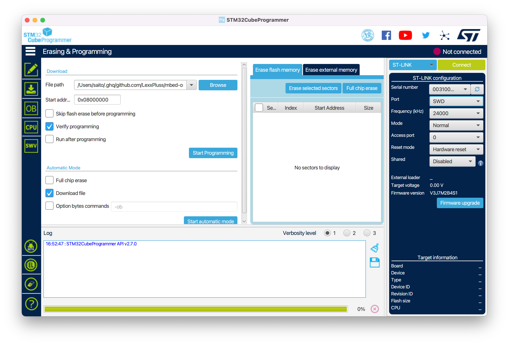

# LexxPluss Power Board Software

[](https://github.com/LexxPluss/LexxHard-PowerBoard-Firmware/actions/workflows/main.yml)
[](https://github.com/LexxPluss/LexxHard-PowerBoard-Firmware/actions/workflows/release.yml)

## Install Mbed CLI 2 (mbed-tools).
https://os.mbed.com/docs/mbed-os/v6.15/build-tools/install-or-upgrade.html

## Install ARM embedded toolchain
https://developer.arm.com/tools-and-software/open-source-software/developer-tools/gnu-toolchain/gnu-rm/downloads

## Build

```bash
$ git clone https://github.com/LexxPluss/LexxHard-PowerBoard-Firmware.git
$ cd LexxHard-PowerBoard-Firmware
$ mbed-tools deploy
$ mbed-tools compile -m LEXXPLUSS_PB01 -t GCC_ARM
```

## Install STLINK Tools

```bash
$ brew install stlink
```

## Program

When writing on battery power, the power switch must be held down to prevent power loss during writing.

### STLINK Tools (Open souce version)

```bash
$ st-flash --connect-under-reset write cmake_build/LEXXPLUSS_PB01/develop/GCC_ARM/LexxHard-PowerBoard-Firmware.bin 0x8000000
```

### STM32CubeProgrammer

On the right side, select ST-LINK, Port is SWD, Reset mode is Hardware reset, and Connect to connect.
The Erasing & Programming screen is displayed on the left side.
Select a file to write with File path, Start address is 0x08000000, and Start Programming to start writing.



## Power Board CAN message

### 512 (0x200)

Power Board Status (Published from Power Board)

| byte offset | info | detail |
|---|---|---|
| 0 | switch status bitmap |  |
| 1 | power status bitmap |  |
| 2 | dc/dc failure bitmap / bmu status bitmap |  |
| 3 | state, wheel disabled bitmap |  |
| 4 | fan duty | 0-100 (%) |
| 5 | charge connector temperature (Positive) | 0-100 (degC) |
| 6 | charge connector temperature (Negative) | 0-100 (degC) |
| 7 | board temperature | -50-127 (degC) |

### 513 (0x201)

Main Board and ROS Status (Published from Main Board)

| byte offset | info | detail |
|---|---|---|
| 0 | Emergency stop | 1:asserted |
| 1 | Power off | 1:asserted |
| 2 | ROS Heartbeat timeout | 1:asserted |
| 3 | mainboard overheat | |
| 4 | actuatorboard overheat | |
| 5 | wheel poweroff | |

### 514 (0x202)

Power Board Notification (Published from Power Board)

| byte offset | info | detail |
|---|---|---|
| 0 | Notification code | 1: battery remaining |

### 515 (0x203)

Power Board Version Message (Published from Power Board)

| byte offset | info | detail |
|---|---|---|
| 0 | major | major version number |
| 1 | minor | minor version number |
| 2 | patch | patch number |

### 516 (0x204)

Power Board Auto Charge Status (Published from Power Board)

| byte offset | info | detail |
|---|---|---|
| 0 | voltage (LSB) | auto charge connector voltage (LSB) (mV) |
| 1 | voltage (MSB) | auto charge connector voltage (MSB) (mV) |
| 2 | count | voltage check count |
| 3 | heartbeat delay | time since the last heartbeat was received (sec) |
| 4 | temperature error | connector temperature sensor error |

### 768 (0x300)

Power Board Log Message (Published from Power Board)

| byte offset | info | detail |
|---|---|---|
| 0-7 | message | NULL terminate string |

## License

Copyright (c) 2022, LexxPluss Inc. Released under the [BSD License](LICENSE).
